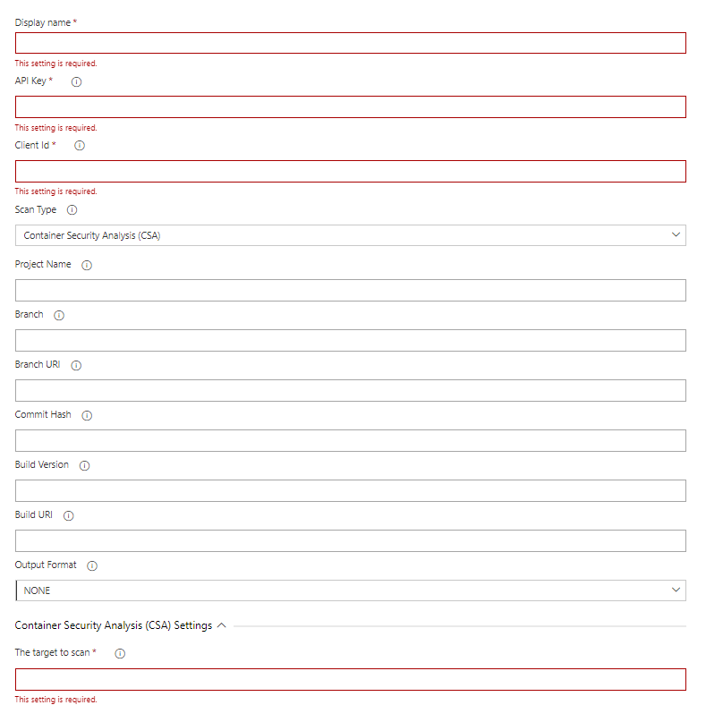

# How to Integrate SOOS CSA with your Azure DevOps CI Pipeline
<div>


</div>
This document will take you step-by-step through the tasks required to set up an Azure project and scan it with SOOS Container Security Analysis (CSA).

## Prerequisites

- You need to have a [SOOS account.](https://app.soos.io/register)
- You need to have a Azure Project configured.

## Steps

### **Installing the task**

The SOOS task will be found under the shared extension listing in your organization settings. Click the option to install the task. The installation has been completed successfully when it is visible under the Installed listing.


### **Setup variables**

Once installed search for SOOS under tasks and proceed with the configuration.


- Select Container Security Analysis (CSA) for the Scan Type parameter
- Configure the SOOS variables, either directly in the yaml section or in the Task variables section.  Use the API Key and Client ID values you collected from the SOOS App.

Make sure to also set the Display Name, Project Name (which groups scans together), Target Uri and Scan mode parameters.



### **Setting up inside your pipeline.yml**

Once these variables have been defined globally, you can set up the Task to be used inside your pipeline.yml following this example script.

```yaml
- task: SOOS-Security-Analysis@0
  inputs:
    apiKey: <SOOS_API_KEY>
    clientId: <SOOS_CLIENT_ID>
    scanType: 'CSA'
    targetToScan: <image:tag> # The target to scan. Should be a docker image name or a path to a directory containing a Dockerfile
    projectName: <PROJECT_NAME> # The name of the project. Defaults to 'Build.Repository.Name'.
```

### **Run It**

To run the SOOS Azure DevOps task against your repository’s code, just execute a build or commit a change. The build will use the environment variables that you created for the API Key and Client ID.

