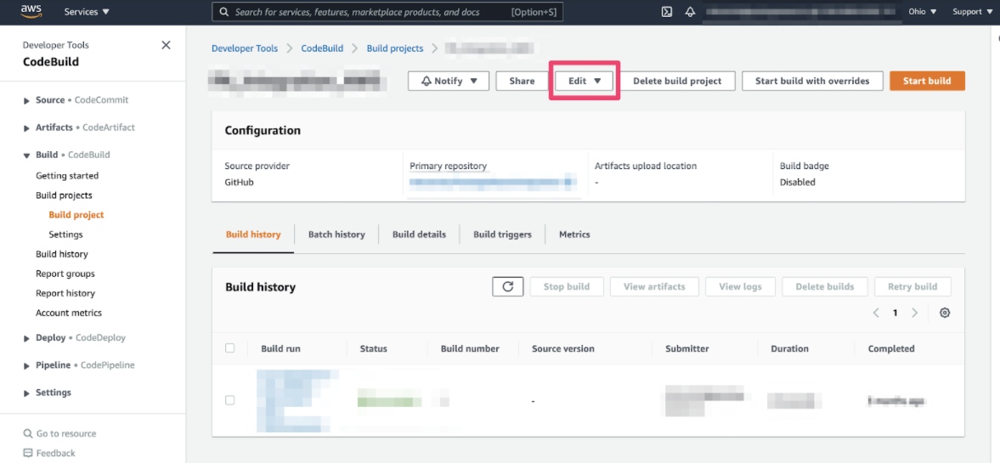
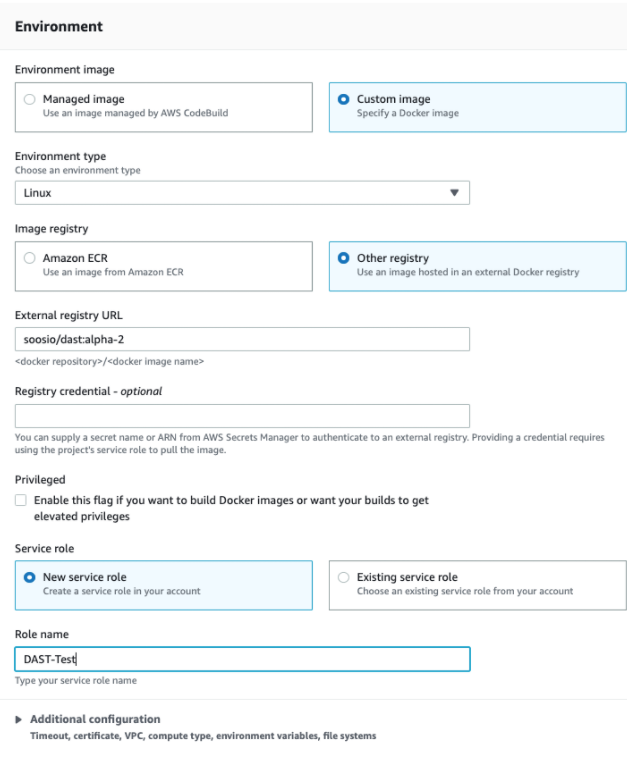
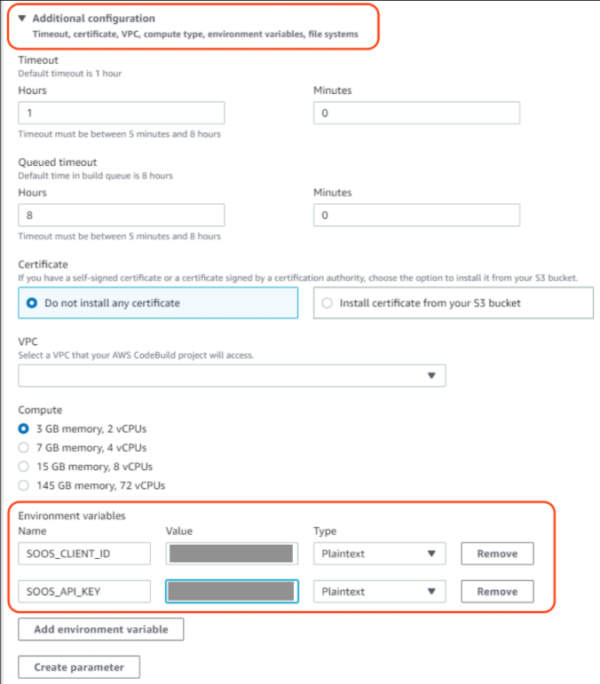
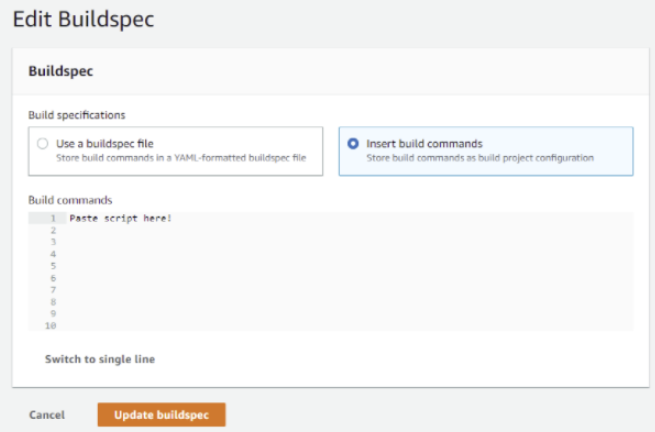

# How to Integrate SOOS DAST with your AWS Codebuild CI
<div>


</div>
In this article we will make the necessary modifications to a simple AWS CodeBuild project to scan a WebApp or API with SOOS DAST.

## Prerequisites
- You need to have a SOOS account.
- You need to have a AWS Codebuild project created

## Steps

### **Configure CodeBuild**

Navigate to your project and select “Environment” from the “Edit” menu.




### **Setup environment variables**
In the main section complete the following inputs:
- Environment Image: Custom Image
- Environment Type: Linux
- Image registry: Other registry
- External registry URL: soos/dast
- Role Name: Use existing or create new role name



Open “Additional Configuration” to reveal the “Environment Variables” section. Create the **SOOS_API_KEY**  and **SOOS_CLIENT_ID** environment variables and copy/paste the values that you found from the SOOS app; these variables will be used by the SOOS CLI during the scans.



### **Set Build Commands**
Return to the 'Edit' menu and select Buildspec > Insert build commands.  Add the script provided in the AWS integration page in the SOOS App. Edit the individual arguments (e.g. the scan mode and the target URL) as needed, and then click the “Update Buildspec” button.

<details open>
<summary> Example Script </summary>

```
version: 0.2

phases:
  build:
    commands:

        - # ARGS:
        - # run soos.py with the -h flag for help
        - # ARGS REQUIRING CUSTOMIZATION:
        - SOOS_PROJECT_NAME="YOUR_PROJECT_NAME_HERE"
        
        - # ARGS WHERE CUSTOMIZATION IS OPTIONAL:
        - SOOS_MODE="run_and_wait"
        - SOOS_ON_FAILURE="fail_the_build"
        - SOOS_DIRS_TO_EXCLUDE="soos"
        - SOOS_FILES_TO_EXCLUDE=""
        - SOOS_ANALYSIS_RESULT_MAX_WAIT=300
        - SOOS_ANALYSIS_RESULT_POLLING_INTERVAL=10
        - # ARGS WHERE CUSTOMIZATION IS OPTIONAL, BUT UNLIKELY:
        - SOOS_API_BASE_URL="https://api.soos.io/api/"
        
        - # CI ENGINE SPECIFIC:
        - eval SOOS_CHECKOUT_DIR="$CODEBUILD_SRC_DIR"
        - SOOS_COMMIT_HASH="${CODEBUILD_RESOLVED_SOURCE_VERSION}"
        - SOOS_BRANCH_NAME=""                            # ENTER BRANCH NAME HERE IF KNOWN
        - SOOS_BRANCH_URI="${CODEBUILD_SOURCE_REPO_URL}" # ENTER BRANCH URI HERE IF KNOWN
        - SOOS_BUILD_VERSION=""                          # ENTER BUILD VERSION HERE IF KNOWN
        - SOOS_BUILD_URI=""                              # ENTER BUILD URI HERE IF KNOWN
        - SOOS_OPERATING_ENVIRONMENT="" # ENTER OPERATING ENVIRONMENT HERE IF KNOWN (default will be provided)
        - SOOS_INTEGRATION_NAME="AWSCodeBuild"

        - # **************************** Modify Above Only ***************#
        - mkdir -p "${SOOS_CHECKOUT_DIR}/soos/workspace"
        - cd "${SOOS_CHECKOUT_DIR}"
        - python3 -m venv .
        - pip3 install -r "${SOOS_CHECKOUT_DIR}/soos/requirements.txt"
        - python3 soos/soos.py -m="${SOOS_MODE}" -of="${SOOS_ON_FAILURE}" -dte="${SOOS_DIRS_TO_EXCLUDE}" -fte="${SOOS_FILES_TO_EXCLUDE}" -wd="${SOOS_CHECKOUT_DIR}" -armw=${SOOS_ANALYSIS_RESULT_MAX_WAIT} -arpi=${SOOS_ANALYSIS_RESULT_POLLING_INTERVAL} -buri="${SOOS_API_BASE_URL}" -scp="${SOOS_CHECKOUT_DIR}" -pn="${SOOS_PROJECT_NAME}" 
```

</details>




### **Run It**
To run the SOOS DAST Analysis against your repository’s code, just execute a build, commit a change, or set up custom build triggers. Check your build logs for detailed scan results as well as a report URL that will allow you to view results in the SOOS app. 

