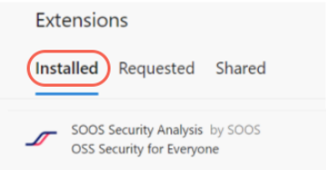
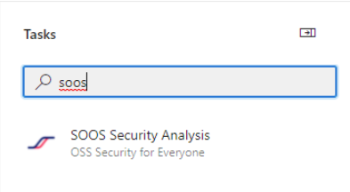
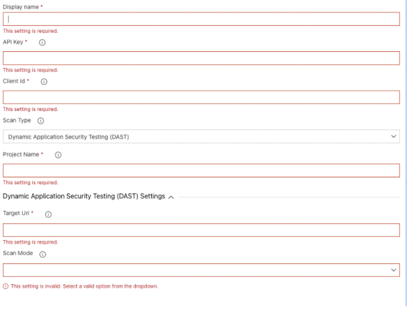

# How to Integrate SOOS DAST with your Azure CI
<div>


</div>
This document will take you step-by-step through the tasks required to set up an Azure project, for scan it with the SOOS DAST Product.

## Prerequisites

- You need to have a [SOOS account.](https://app.soos.io/register)
- You need to have a Azure Project configured.

## Steps

### **Installing the task**

The SOOS task will be found under the shared extension listing in your organization settings. Click the option to install the task. The installation has been completed successfully when it is visible under the Installed listing.



### **Setup variables**

Once installed search for the SOOS under tasks and proceed with the configuration.



- Select Dynamic Application Security Testing (DAST) for the Scan Type parameter
- Configure the SOOS variables, either directly in the yaml section or in the Task variables section.  Use the API Key and Client ID values you collected from the SOOS App.

Make sure to also set the Display Name, Project Name (which groups scans together), Target Uri and Scan mode parameters.



### **Setting up inside your pipeline.yml**

Once we have defined these variables globally you can set up the task to be used inside your pipeline.yml following this example script.

```
- task: SOOS-Security-Analysis@0
  inputs:
    apiKey: {SOOS_API_KEY}
    clientId: {SOOS_CLIENT_ID}
    scanType: 'DAST'
    project: {YOUR_PROJECT_NAME_HERE}
    targetUri: 'https://example.com'
    scanMode: 'baseline'
```

### **Run It**

To run the SOOS Azure DevOps task against your repository’s code, just execute a build or commit a change. The build will use the environment variables that you created for the API Key and Client ID.

