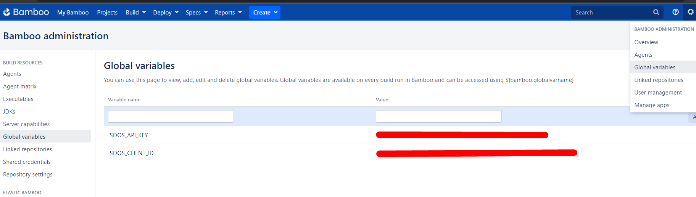
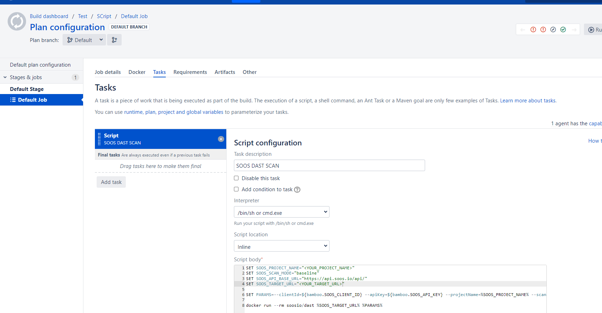

# How to Integrate SOOS DAST with your Bamboo CI

Set up a Bamboo pipeline project and scan an endpoint with SOOS DAST.

## Prerequisites
- You need to have a [SOOS account.](https://app.soos.io/register)
- You need to have a Bamboo project created.
- Docker needs to be installed on the agent machine.

## Steps

### **Getting the script**
* Navigate to the [Bamboo DAST integration page on the SOOS App](https://app.soos.io/integrate/dast?id=bamboo) and pick the right file for your OS.

### **Setting environment variables**
Create the SOOS_API_KEY and SOOS_CLIENT_ID environment variables, under the Global Variables section (this can be encountered in the settings wheel in Bamboo). These will serve as environment variables to be used by the SOOS CLI. Use the API Key and Client ID values you collected from [Bamboo DAST integration page on the SOOS App](https://app.soos.io/integrate/dast?id=bamboo).

### **Running on Windows**

* Create a new script task in your bamboo project
* Use the `dast-script.bat` downloaded before, or just copy the code and paste it inside the inline script.

### **Running on Linux or Mac OS**

**Repo Setup**

* Create a new folder in your git repository: `<repo_root>/bamboo-specs`
* Place the bamboo.yml under  `<repo_root>/bamboo-specs/` folder that you created in step # 1 above.
* Commit the new file and the new folder path to your repository.

**Configure Bamboo Build**

* Navigate to Administration > Linked repositories 
* Select your desired repository. In the Bamboo Specs tab enable Scan for Bamboo Specs. 
* In the Specs status tab you can scan for the bamboo.yml file.

### Run It
To run SOOS DAST against your webapp, just run the plan you created in the specs file. The build will use the environment variables that you created for the API Key and Client ID.

---

## Reference
* To see the full list of available parameters go to [SOOS DAST Scan Parameters](https://github.com/soos-io/soos-dast#parameters)