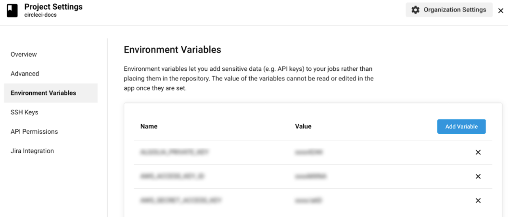

# How to Integrate SOOS DAST with your CircleCI CI
<div>


</div>
In this article we will make the necessary modifications to a simple CircleCI project to scan a GitHub or Bitbucket repository with the SOOS CircleCI Orb.

## Prerequisites

- You need to have a [SOOS account.](https://app.soos.io/register)
- You need to have a CircleCI project.

## Steps

### **Repo Setup**
- Create a directory called .circleci in the root directory of your local GitHub or Bitbucket code repository.
- Create a config.yml file inside the .circleci directory with the following lines (if you are using CircleCI server v2.x, use version: 2.0 configuration):

```
    version: 2.1
    orbs:
        soos: soos-io/dast@1.0.0

    workflows:
        main:
            jobs:

                # NOTE: YOUR OTHER JOBS GO HERE

                - soos/run-dast-analysis:
                    client_id: "<<SOOS Client Id env var name IF YOURS IS SOOS_CLIENT_ID there's no need to pass anything>>"
                    api_key: "<<SOOS API Key en var name IF YOURS IS SOOS_API_KEY there's no need to pass anything>>"
                    project_name: "<<Project Name>>"
                    target_url: "<<Your Target URL To Scan>>"

                # NOTE: YOUR OTHER JOBS GO HERE
```


- Commit and push the changes.
- Go to the Projects page in the CircleCI app, click the Add Projects button, then click the Set Up Project button next to your project. If you don’t see your project, make sure you have selected the associated Org. See the Org Switching section below for tips.
- Click the Start Building button to trigger your first build. (Previous this step, you must to setup the environment variables)

### **Build Setup**
- In the CircleCI application, go to your project’s settings by clicking the gear icon on the Pipelines page, or the three dots on other pages in the application.

- Click on Environment Variables.
- Add the SOOS_CLIENT_ID and SOOS_API_KEY variables by clicking the Add Variable button and enter the name and the value provided by the SOOS App. (See screenshot from Integration Steps section) 

### **Additional Info**
- For more technical information about the our DAST Orb you can refer to
https://github.com/soos-io/soos-dast-circleci-orb

