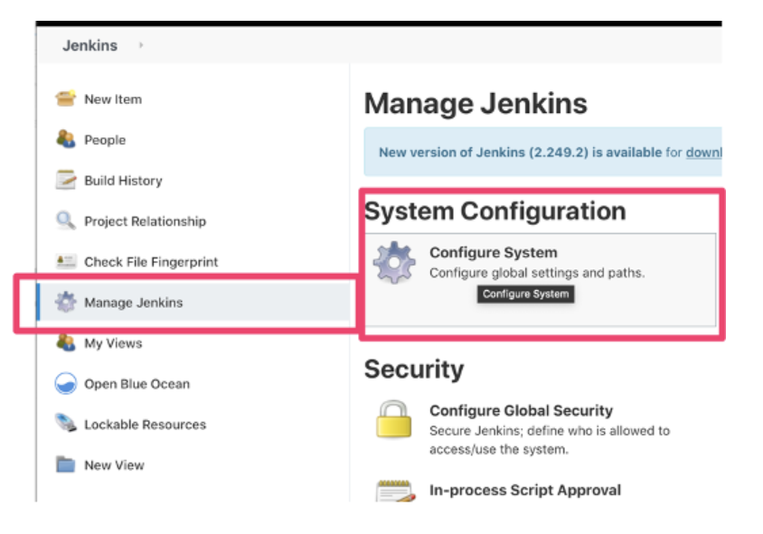
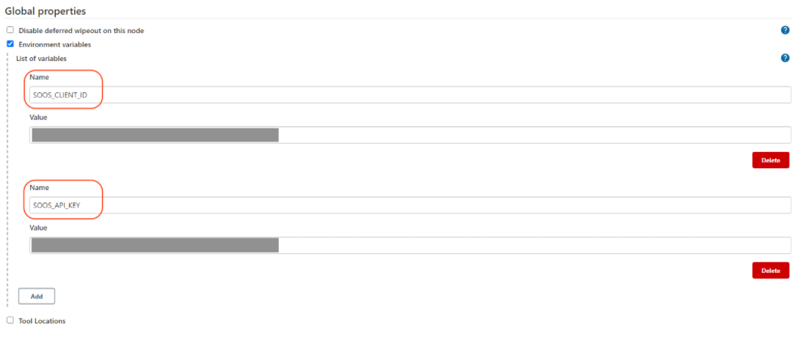
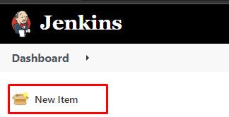
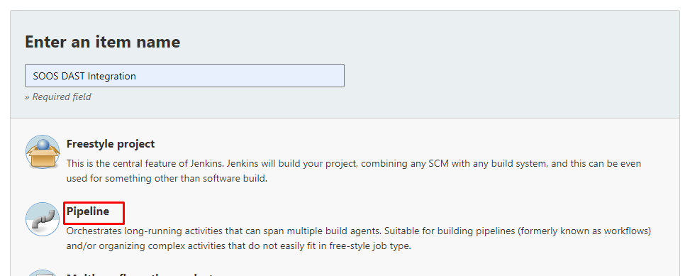

# How to Integrate SOOS DAST with your Jenkins CI

Set up a Jenkinsfile and scan an endpoint with SOOS DAST

## Prerequisites

- You need to have a [SOOS account.](https://app.soos.io/register)
- Have [docker installed.](https://docs.docker.com/get-docker/) in Jenkins Host machine.
## Steps
### **Getting the script**
* Navigate to the [Jenkins DAST integration page on the SOOS App](https://app.soos.io/integrate/dast?id=jenkins) and copy the `Jenkinsfile` script content according to the OS you're running Jenkins on.
### **Setup your Repo**
Create a file called `Jenkinsfile` in the root of your repository and paste the content from the above step.

### **Environment Setup**

Navigate to Jenkins -> Manage Jenkins -> Configure System

Under "Global Properties", select the Environment variables checkbox and add SOOS_CLIENT_ID and SOOS_API_KEY to the List of Variables.  Populate the Value field for each with the appropriate information obtained from the SOOS app. These will be used by the SOOS CLI. 

### **Setting up Jenkins Project**

Add "New Item" in the Jenkins main menu.

Enter a name for the item and select Pipeline

On the next screen:
1. Type in a description for your item.
2. Select the Pipeline Tab.
3. Choose 'Pipeline script from SCM' in the Definition field. (If you don't want to use a `Jenkinsfile` you can just paste the pipeline content in here)
4. In the SCM field select 'Git'.
5. Enter the link to your GitHub repo in the Repository URL field and enter the corresponding credentials when prompted.
6. Write the Jenkinsfile path in the Script Path field and select Apply and Save.

### **Run It**
To run SOOS DAST against your webapp, just execute a build. The build will use the environment variables that you created for the API Key and Client ID.

## Reference
* To see the full list of available parameters go to [DAST repository parameters description](https://github.com/soos-io/soos-dast#parameters)