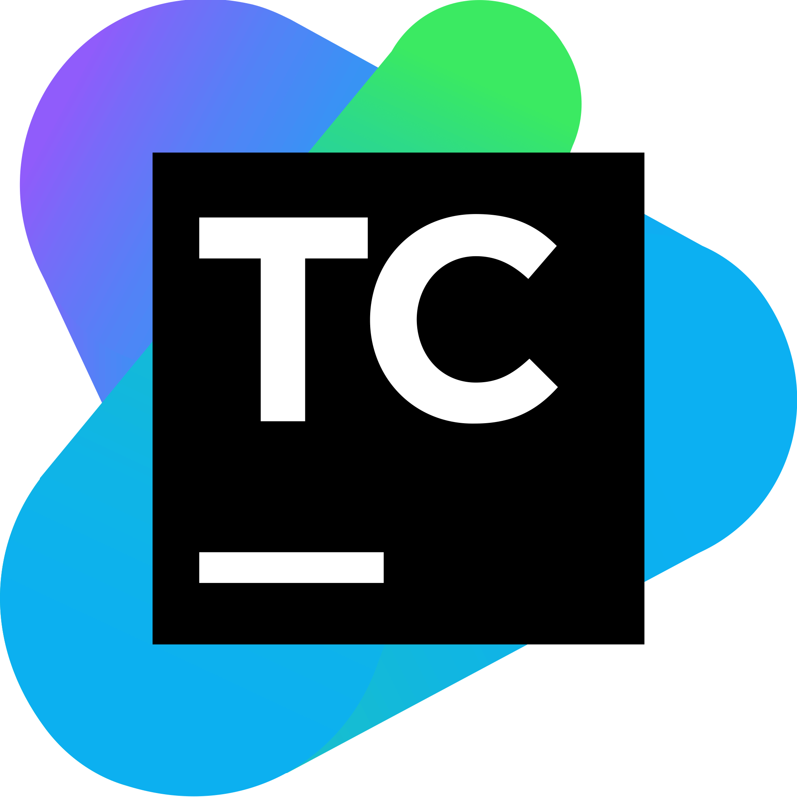

# How to Integrate SOOS DAST with your Teamcity CI

Set up TeamCity to scan an endpoint with SOOS DAST

## Prerequisites
- You need to have a [SOOS account](https://app.soos.io/register) with DAST scanning enabled.

### **Get the Example**

* Navigate to the [TeamCity DAST integration page on the SOOS App](https://app.soos.io/integrate/dast?id=teamcity), copy the example, and modify it.

### **Run It**

* Execute the pipeline

---

## Reference
* To see the full list of available parameters go to [SOOS DAST Scan Parameters](https://github.com/soos-io/soos-dast#parameters)