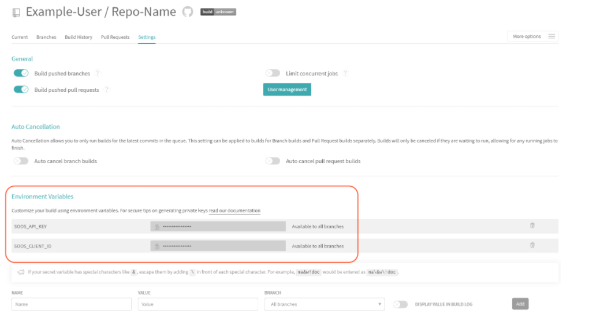

# How to Integrate SOOS DAST with your Travis CI
<div>


</div>
In this article we will make the necessary modifications to a simple TravisCI project to scan a GitHub or Bitbucket repository with the SOOS DAST Docker Image.

## Prerequisites

- You need to have a [SOOS account.](https://app.soos.io/register)
- You need to have a Travis repo.

## Steps

### **Repo Setup**
Add a .travis.yml file to your repository to tell Travis CI what to do. Travis only runs builds on the commits you push after you’ve added a .travis.yml file.

Based on your preferences you can add the content for the file added on step 1 choosing between three scan modes:

* Baseline Scan
    * It performs a passive scan of HTTP messages (requests and responses) sent to the web application being tested. 
        * Passive scanning does not change the requests nor the responses in any way and is therefore safe to use.
    * The parameters clientId, apiKey, and projectName are required
    * We recommend defining apiKey and clientId as Environment Variables (see Build Setup section) to protect your credentials

```
os: linux
services: docker

env:
  global:
    - PROJECT_NAME: SOOS_DAST_TravisCI_Example
    - SCAN_MODE: baseline
    - TARGET_URL: <URL to be scanned>

script:
  - docker run soosio/dast
                    --clientId=SOOS_CLIENT_ID
                    --apiKey=SOOS_API_KEY 
                    --projectName=PROJECT_NAME
                    --scanMode=SCAN_MODE
                    TARGET_URL
```

* Full Scan 
    * This scan mode is used to perform a full analysis of a web-app. 
    * It performs an active scan, attempting to find potential vulnerabilities by using known attacks against the selected targets. 
        * It should be noted that active scanning can only find certain types of vulnerabilities. Logical vulnerabilities, such as broken access control, will not be found by any active or automated vulnerability scanning.
    * The parameters clientId, apiKey, and projectName are required
    * We recommend defining apiKey and clientId as Environment Variables (see Build Setup section) to protect your credentials

```
os: linux
services: docker

env:
  global:
    - PROJECT_NAME: SOOS_DAST_TravisCI_Example
    - SCAN_MODE: fullscan
    - TARGET_URL: <URL to be scanned>

script:
  - docker run soosio/dast
                    --clientId=SOOS_CLIENT_ID
                    --apiKey=SOOS_API_KEY 
                    --projectName=PROJECT_NAME
                    --scanMode=SCAN_MODE
                    TARGET_URL
```

* API Scan 
    * The api scan performs an analysis of APIs.
    * In addition to clientId, apiKey, and projectName, the apiscanFormat must be defined. 
        * It must be a specific value: openapi, soap, or graphql
    * We recommend defining apiKey and clientId as Environment Variables (see Build Setup section) to protect your credentials

```
os: linux
services: docker

env:
  global:
    - PROJECT_NAME: SOOS_DAST_TravisCI_Example
    - SCAN_MODE: apiscan
    - API_FORMAT: openapi # soap or graphql
    - TARGET_URL: <URL to be scanned> # It has to be an api definition url

script:
  - docker run soosio/dast
                    --clientId=SOOS_CLIENT_ID
                    --apiKey=SOOS_API_KEY 
                    --projectName=PROJECT_NAME
                    --scanMode=SCAN_MODE
                    --apiScanFormat=API_FORMAT
                    TARGET_URL
```

### **Configure Travis CI**
**Setup Environment Variables**

Create the SOOS_API_KEY and SOOS_CLIENT_ID environment variables in the provided "Environment variables" text field. These will serve as environment variables to be used by the Package Aware CLI. Use the API Key and Client ID values you collected from the SOOS App.



**Add The Build Configuration**

Within your repo’s `.travis.yml` file, your configuration should contain the yaml snippet found in the SOOS App.

**Run It**

To run the SOOS DAST Analysis against your webapp or API, just execute a build or commit a change. The build will use the environment variables that you created for the API Key and Client ID.


