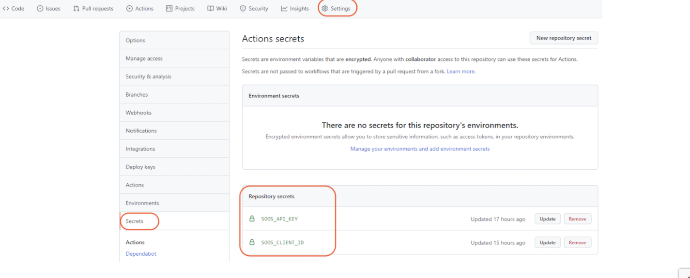

# How to Integrate SOOS SCA with your GitHub Repo
<div>


</div>
In this article we will make the necessary modifications to a GitHub Workflow using the SOOS CI Analysis GitHub Action to scan a GitHub repository with SOOS.

## Prerequisites

- You need to have a [SOOS account.](https://app.soos.io/register)
- You need to have a GitHub Repo.

## Steps

### **Repo Setup**
* Create a `.github/workflows` directory in your repository on GitHub if this directory does not already exist.
* In the `.github/workflows` directory, create a file named main.yml.
For more information, see "Creating new files" in GitHub Docs.
* Paste the script given in the [GitHub Action SCA Integration page on SOOS](https://app.soos.io/integrate/sca?id=github-actions).


### **Build Setup**

Setup Environment Variables

Under your Repository's Settings tab, select "Secrets" > "Actions" and add two new secrets which contain the SOOS Client Id and API Key which you can find in the SOOS App under [Integrate](https://app.soos.io/integrate)

The secret names should be "SOOS_CLIENT_ID" and "SOOS_API_KEY"



### **Build Config**
Modify the `.github/workflows/main.yml` file, replacing the provided project_name variable value with one that is relevant to your project.

## Run It
To run the SOOS CLI against your repository’s code, just execute a build or commit a change. The build will use the environment variables that you created for the API Key and Client ID.

 
## **Configure GitHub Code Scan Output**

If you are using GitHub Enterprise or your repository is public, you can configure the SOOS Action to display any issues in GitHub Code Scanning Alerts. There are a few additional steps to get this configured.

### **Setup**

   - Create a new GitHub Personal Access Token which has a "repo" > "security_events" scope
   - Copy the PAT value and add it to a new Action Secret for your repository with a name of "SOOS_GPAT"
   - Adjust your Action code to pass the "sarif" and "gpat" parameters

```
name: Example workflow using SOOS
# Events required to engage workflow (add/edit this list as needed)
on: push
jobs:
  synchronous-analysis-with-blocking-result:
    name: SOOS SCA Scan
    runs-on: ubuntu-latest
    steps:

    - uses: actions/checkout@master

    - name: Run SOOS - Scan for vulnerabilities
      uses: soos-io/soos-sca-github-action@vX.Y.Z # Get Latest Version from https://github.com/marketplace/actions/soos-core-sca
      with:
        project_name: "My Project Name"
        sarif: true
        gpat: ${{ secrets.SOOS_GPAT }}
        client_id: ${{ secrets.SOOS_CLIENT_ID }}
        api_key: ${{ secrets.SOOS_API_KEY }}
```
