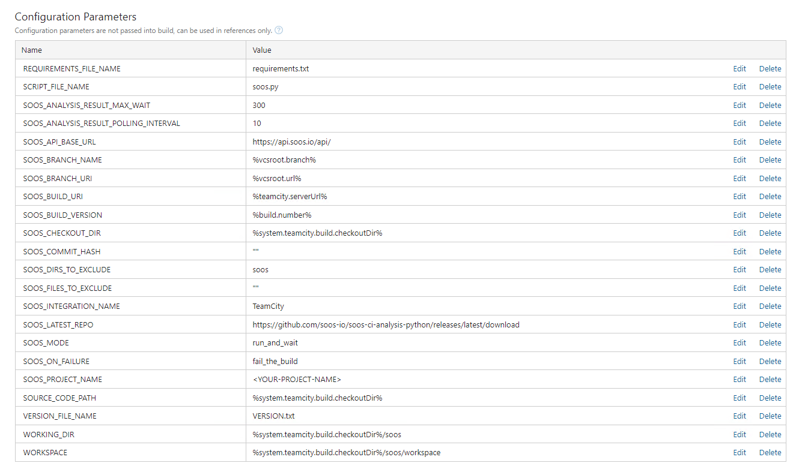

# How to Integrate SOOS SCA with your TeamCity CI

In this article we will make the necessary modifications to a simple TeamCity project to scan a GitHub repository with SOOS.

## Prerequisites
- You need to have a [SOOS account.](https://app.soos.io/register)
- You need to have a TeamCity project.

## Steps

### **Configure TeamCity Environment variables**
* Within the TeamCity project, navigate to **Build Configurations**.
* Select the **Create build configuration** button and enter a name for the new build.
In the left-hand menu, select **Parameters**.
* Create the env.SOOS_API_KEY and env.SOOS_CLIENT_ID environment variables in the **Environment Variables** section.
* Copy & paste the API key and Client ID values from the [TeamCity Integration page of the SOOS App](https://app.soos.io/integrate/sca?id=teamcity).  These will serve as environment variables to be used by the SOOS CLI.

### **Add The Build Configuration**
* Within your **Build Configuration** select **Build Step** in the left-hand menu.
* Click the **Add build step** button.
* When prompted, select Node.js from the **Runner type** menu.
* Give the build step a name that is relevant (such as SOOS Analysis) and enter the SOOS script from the [TeamCity Integration page of the SOOS App](https://app.soos.io/integrate/sca?id=teamcity) to the **Shell script** field.
* To make sure we have an stable environment to run the scan use the **Run step within Docker container** option and set it to **node:18-slim**
* Make sure to set the Project Name (which groups scans together) and the Build/Branch parameters.
    * Providing the build/branch parameters allows us to tie together scans and issues, and provide more meaningful insights and actionability to you.
* Save your new step.

### **Configure Script Parameters**
Within your **Build Configuration**, select **Parameters** from the left-hand menu. Use the values shown below to populate the available parameters.  Customize as needed.

## Run It
To run the SOOS CLI against your repository’s code, just execute a build or commit a change. The build will use the environment variables that you created for the API Key and Client ID.

## Reference
* To see the full list of available parameters go to [Script repository parameters description](https://github.com/soos-io/soos-sca?tab=readme-ov-file#parameters)
