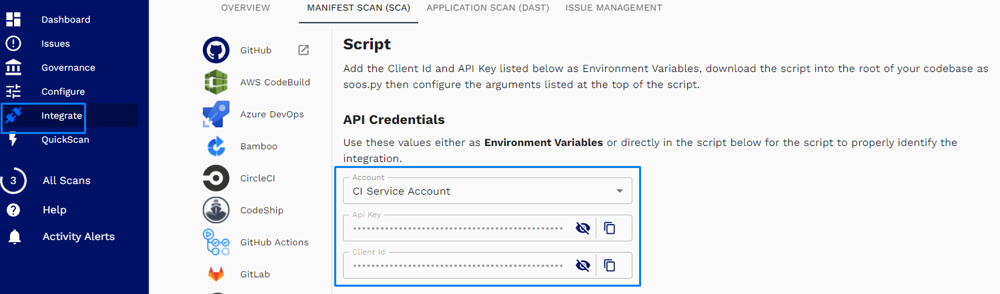

Get the <code>Client Id</code> and the <code>API Key</code> values

To be able to run a `SOOS DAST Analysis Scan` you need to get the `Client Id` and the `API Key` from the SOOS Application.
<!-- Add screenshot of place where you can get it -->
1. Go to [SOOS](https://app.soos.io) and log into it using your `SOOS` account.
2. In the menu on the left side of the screen, click on `Integrate` menu option.
3. On the `API Credentials` section, you will see the `API Key` and the `Client Id` values. You need to copy both clicking on the copy button

**Note**: We strongly recommend using a `Service Account` for integrations. Read more about `Service Accounts` and how to create them [here](https://kb.soos.io/help/what-is-a-service-account-user-and-when-might-i-need-to-create-one).
